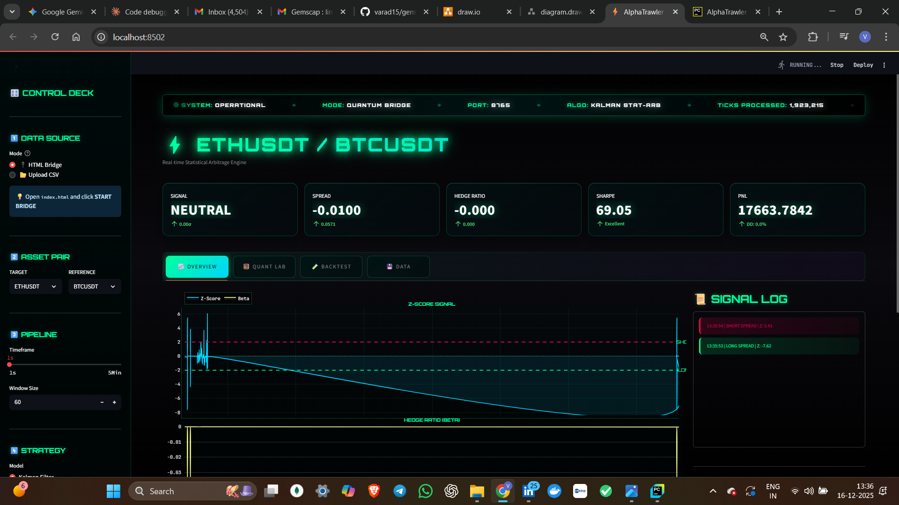
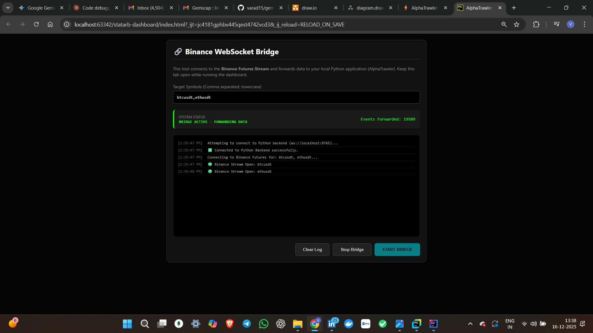
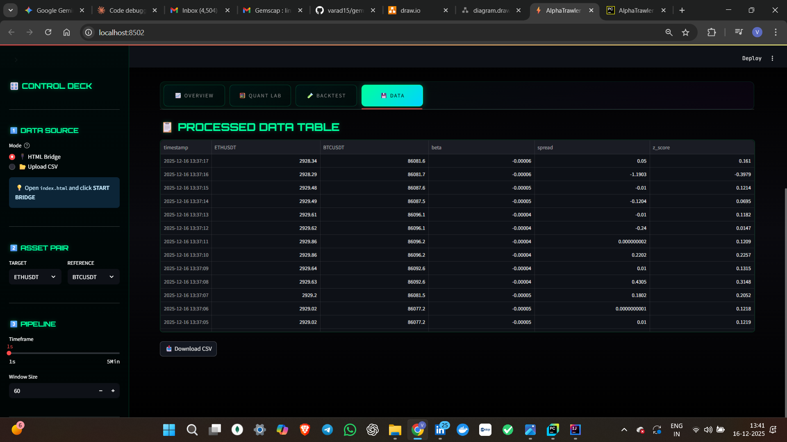
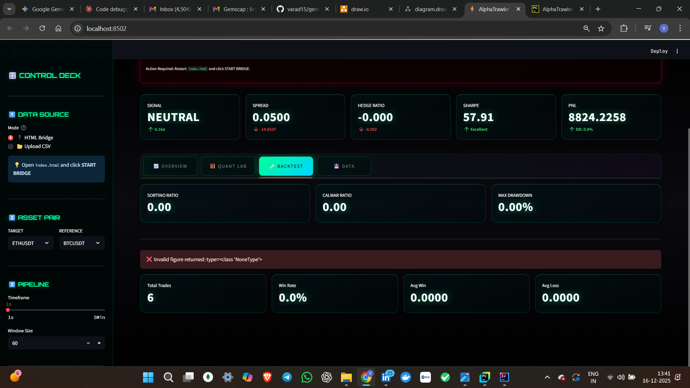

# ⚡ AlphaTrawler: Real-Time Quantitative Trading Dashboard

  

## Home Page

## Bridge

## Features

---

## Overview

AlphaTrawler is a quantitative trading dashboard that ingests live tick data from Binance Futures, processes it through statistical models, and visualizes real-time statistical arbitrage signals. It uses a custom **Bridge Architecture** to connect a browser-based WebSocket client with a Python analytics backend and a Streamlit UI.

### What It Does

- Streams live cryptocurrency prices (e.g., BTCUSDT, ETHUSDT) from Binance via a browser bridge.
- Computes hedge ratios with **Kalman Filter** and **Rolling OLS**, plus rolling **Z-Score** and stationarity checks.
- Generates rule-based long/short spread signals and configurable custom z-score alerts.
- Runs a vectorized backtest engine with equity curve, Sharpe, Sortino, Calmar, drawdown, and trade-level stats.
- Exports both processed price data and analytics outputs (equity curve, summary stats) for offline analysis.

---

## Architecture

The system uses a Producer–Consumer / Bridge pattern to decouple live WebSocket ticks from analytics and visualization.

**Data Flow**
Binance API → HTML/JS Client → Python Bridge (8765) → SQLite → Analytics Engine → Streamlit Dashboard (8501)

**Key Components**

1. **HTML/JS Client (`index.html`)**
  - Subscribes to Binance Futures WebSocket streams.
  - Forwards tick data (symbol, price, timestamp) via a local WebSocket to the Python ingestion server.

2. **Python Ingestion Server (Port 8765)**
  - Listens for tick messages from the browser.
  - Persists ticks into a local SQLite database (`market_data.db`).
  - Runs in a background thread when the dashboard starts.

3. **Data Processor & Database Layer**
  - Uses SQLAlchemy models (`Tick`, `Bar`) to store and resample data.
  - Resamples ticks into OHLC bars at selectable granularities (1s, 5s, 1m, 5m).

4. **Analytics Engine (`AnalyticsEngine`)**
  - `calculate_kalman_hedge_ratio`: dynamic beta and spread via a Kalman Filter.
  - `calculate_rolling_ols`: rolling OLS regression to compute static hedge ratios.
  - `calculate_zscore`: rolling z-score of the spread.
  - `perform_adf_test`: Augmented Dickey–Fuller test for spread stationarity.

5. **Backtest Engine (`run_backtest`)**
  - Runs a vectorized mean-reversion strategy over the spread and z-score series.
  - Returns equity curve, Sharpe, total return, trade count, win rate, average win, average loss, positions, max drawdown, and trade log.

6. **Streamlit Dashboard (`app.py`)**
  - Cyberpunk-themed UI with Plotly charts and real-time KPIs.
  - Tabs: **Overview**, **Quant Lab**, **Backtest**, **Data**.
  - Shows latest signal, hedge ratio, PnL, risk metrics, and downloadable data/analytics files.

---

## Quick Start

### Prerequisites

- Python **3.9+**
- Modern web browser (Chrome / Firefox)

### Installation

Clone and install
git clone https://github.com/varad15/alphatrawler.git
cd alphatrawler
pip install -r requirements.txt
Launch dashboard
streamlit run app.py

### Start the Data Feed (Live Mode)

1. Open `index.html` in your browser.
2. Click the **START BRIDGE** button.
3. Open the browser console (F12) and confirm you see "Forwarding tick..." messages.
4. The Streamlit dashboard should populate charts once enough ticks are collected.

If charts stay empty, check that:

- Ports **8765** (bridge) and **8501** (Streamlit) are not blocked.
- Symbols in `config.PAIRS` match what `index.html` subscribes to.

### Backtest / Offline Mode

1. From the sidebar, switch to **📂 Upload CSV** mode.
2. Upload a CSV with at least columns: `timestamp`, `symbol`, `close`.
3. Select the target and reference symbols present in the CSV.
4. The app will pivot prices and run the same analytics and backtest on historical data.

---

## Features

### Statistical Models

- **Kalman Filter Hedge Ratio**
  - Adaptive beta estimation between independent (e.g., BTCUSDT) and dependent (e.g., ETHUSDT) symbols.
  - Returns a time series of betas and a mean-reverting spread.

- **Rolling OLS Regression**
  - Rolling window regression with configurable `window` (e.g., 60).
  - Produces a static-ish hedge ratio and corresponding spread series.

- **Z-Score Signals**
  - Rolling z-score of the spread; entry when \(|z|\) exceeds the entry threshold, exit near mean.
  - Sidebar controls for entry and exit thresholds (`Entry Z`, `Exit Z`).

- **Stationarity Testing (ADF)**
  - "Quant Lab" tab runs an Augmented Dickey–Fuller test on the spread.
  - Displays p-value, test statistic, and a mean-reversion verdict.

### Monitoring & Alerts

- **Bridge Health / Heartbeat**
  - Banner ticker showing system mode, port, ticks processed, bars formed, and latency target.
  - Warning card if no data received for more than 2 seconds (BRIDGE DISCONNECTED).

- **Signal Logging**
  - Logs each non-neutral signal with timestamp, direction, and z-score.
  - Sidebar "Signal Log" panel with neon-styled buy/sell rows.

- **Custom Alert Rules**
  - Optional user-defined upper and lower z-score thresholds (checkbox + inputs in the sidebar).
  - Generates alerts when z-score crosses these custom levels, independent of the base strategy thresholds.

### Backtesting & Risk Metrics

- **Vectorized Mean-Reversion Backtest**
  - Uses spread and z-score to simulate long/short spread trades.
  - Returns: equity curve, total PnL, Sharpe, trade-level PnL, win rate, average win, average loss, and max drawdown.

- **Risk / Performance Metrics**
  - `MetricsEngine` computes Sortino, Calmar, max drawdown and exposes Sharpe and total return.
  - KPI cards show current signal, spread deviation, hedge ratio change, Sharpe classification, and PnL vs drawdown.

- **Equity Curve Visualization**
  - Cyberpunk-styled equity curve with gradient fill and running peak line.

### Data & Analytics Export

- **Processed Data Export**
  - "💾 DATA" tab offers a **Download CSV (Processed)** button for the post-analytics DataFrame (prices, beta, spread, z-score).

- **Analytics Outputs Export**
  - When backtest results are available, an Excel file (`analytics_outputs_*.xlsx`) is generated with:
    - Equity curve over time.
    - Summary sheet with Sharpe, total return, Sortino, Calmar, and max drawdown.

---

## Configuration

Core configuration lives in `src/config.py`.

--- Trading Universe ---
PAIRS = [
{"symbol": "BTCUSDT", "role": "independent", "min_notional": 50, "min_volume": 10_000},
{"symbol": "ETHUSDT", "role": "dependent", "min_notional": 50, "min_volume": 10_000},
]

--- Liquidity Filters ---
MIN_NOTIONAL_USD = 50
MIN_24H_VOLUME_USD = 100_000

--- Analytics Defaults ---
REFRESH_RATE_MS = 1000
DEFAULT_TIMEFRAME = "1s"
ROLLING_WINDOW = 60
Z_SCORE_ENTRY = 2.0
Z_SCORE_EXIT = 0.0

You can extend this to:

- Add more symbols for multi-asset analysis (ensure `index.html` also subscribes to them).
- Tighten liquidity filters or adjust default rolling window and z-score thresholds.

---

## Requirements Mapping

| Requirement                          | Implementation / Location                                   | Status |
|-------------------------------------|-------------------------------------------------------------|--------|
| Live data source via HTML bridge    | `index.html` + WebSocket server on port 8765               | ✅     |
| Persistent tick ingestion           | SQLite via SQLAlchemy (`Tick`, `Bar`)                      | ✅     |
| Resampling to OHLC bars             | `DataProcessor.resample_ticks_to_bars`                     | ✅     |
| Multiple timeframes (1s–5m)         | Sidebar `Timeframe` selector                               | ✅     |
| Analytics: Kalman, OLS, Z-Score     | `AnalyticsEngine` (`calculate_kalman_hedge_ratio`, etc.)   | ✅     |
| ADF stationarity test               | `perform_adf_test` + Quant Lab metrics                     | ✅     |
| Backtesting engine                  | `run_backtest` in `src/backtest.py`                        | ✅     |
| Full trade statistics               | `num_trades`, `win_rate`, `avg_win`, `avg_loss`, `trades`  | ✅     |
| Equity curve visualization          | `QuantVisualizer.plot_equity`                              | ✅     |
| Risk metrics (Sharpe, Sortino etc.) | `MetricsEngine.generate_report`                            | ✅     |
| Rule-based alerts                   | Strategy + custom z-score alert controls in sidebar        | ✅     |
| Data export (analytics outputs)     | CSV + Excel downloads in **💾 DATA** tab                   | ✅     |
| Architecture diagram                | `architecture_diagram.png` in repo                         | ✅     |
| README & AI usage disclosure        | This `README.md`                                           | ✅     |

---

## AI Usage Disclosure

In the spirit of transparency, AI assistance (ChatGPT/Claude-style models) was used in the following ways:

- **UI / CSS Styling**
  - Prompts like: "Write CSS for a Streamlit app with a dark 'cyberpunk' theme using neon cyan/purple accents and glassmorphism metric cards."

- **Boilerplate and Refactoring**
  - Generating initial SQLAlchemy session boilerplate and model patterns for ticks and bars.
  - Refactoring `app.py` into clearer sections (kernel, theme, analytics, visualization, controller).
  - Suggestions for safer error-handling in analytics and backtest code.

- **Mathematical Verification**
  - Verifying Kalman Filter update equations and covariance matrix updates.
  - Confirming formulas for Sharpe, Sortino, and drawdown computation.

- **Documentation Support**
  - Drafting and polishing this `README.md` and short explanatory comments in code.

All core design decisions—system architecture, trading logic, parameter selection, and final implementation details—were reviewed and adjusted manually to ensure they match the assignment requirements and behave as expected.

---

## Technical Stack

- **Backend:** Python 3.9+, Pandas, NumPy, Statsmodels, SQLAlchemy, SQLite
- **Frontend:** Streamlit, Plotly
- **Data Source:** Binance Futures WebSocket (via browser bridge)

---

## Disclaimer

This project is for educational and research purposes only. It does **not** constitute financial advice. Cryptocurrency derivatives are highly volatile and risky; always do your own research and consult a qualified professional before trading.

---

## Contact

Developed as part of a Quantitative Developer / Trading Systems technical evaluation.

- **GitHub:** https://github.com/varad15
- **Email:** [varadjumbad15@gmail.com](mailto:varadjumbad15@gmail.com)
