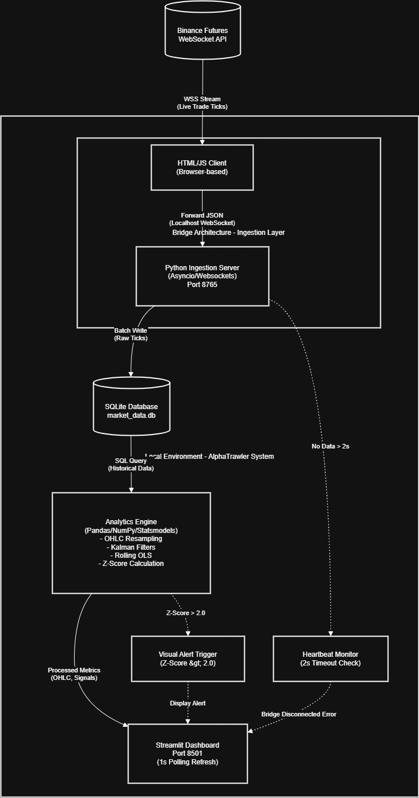

# ⚡ AlphaTrawler: Real-Time Quantitative Trading Dashboard

  

## Overview

AlphaTrawler is a quantitative trading dashboard that ingests live tick data from Binance Futures, processes it through statistical models, and visualizes real-time arbitrage signals. It uses a custom **Bridge Architecture** to work with a browser-based WebSocket client while maintaining a robust Python backend for analytics.

### What It Does
- Streams live cryptocurrency prices from Binance
- Calculates statistical arbitrage signals using Kalman Filters and Rolling OLS
- Visualizes trading opportunities in real-time
- Monitors system health and alerts on disconnections

---
## Architecture

The system uses a Producer-Consumer pattern to bridge the browser-based data feed with Python analytics.



**Data Flow:**
```
Binance API → HTML/JS Client → Python Server → SQLite → Analytics Engine → Dashboard
```

**Key Components:**

1. **HTML/JS Client** (`index.html`) - Receives ticks from Binance and forwards them locally
2. **Python Ingestion Server** (Port 8765) - Captures and buffers data into SQLite
3. **Analytics Engine** - Resamples ticks into OHLC bars, runs Kalman/OLS models, calculates Z-Scores
4. **Streamlit Dashboard** (Port 8501) - Live visualization with 1-second refresh

---

## Quick Start

### Prerequisites
- Python 3.9+
- Modern web browser (Chrome/Firefox)

### Installation

```bash
# Clone and install
git clone https://github.com/yourusername/alphatrawler.git
cd alphatrawler
pip install -r requirements.txt

# Launch dashboard
streamlit run app.py
```

### Start the Data Feed

**Critical Step:** The dashboard needs live data to function.

1. Open `index.html` in your browser
2. Click the **"START BRIDGE"** button
3. Confirm you see "Forwarding tick..." logs in the console (F12)
4. Dashboard charts should populate within seconds

**Troubleshooting:** If nothing appears, check that ports 8765 and 8501 aren't blocked by your firewall.

---

## Features

### Statistical Models

**Kalman Filter**
- Dynamically estimates hedge ratio between BTC and ETH
- Adapts to market regime changes in real-time

**Rolling OLS Regression**
- Static hedge ratio estimation for comparison
- Configurable window size (20-200 periods)

**Z-Score Signals**
- Entry threshold: ±2.0 standard deviations
- Exit threshold: ±0.5 standard deviations

**Stationarity Testing**
- Real-time ADF test to validate mean-reversion
- Only trades when p-value < 0.05

### Monitoring & Alerts

**Heartbeat Monitor**
- Detects if no data received for >2 seconds
- Displays "BRIDGE DISCONNECTED" warning

**Signal Logging**
- Timestamps every entry/exit signal
- Tracks Z-Score and spread at signal time
- Exportable for analysis

### Operation Modes

**Live Mode** - Real-time streaming via the Bridge  
**Backtest Mode** - Upload historical CSV files to test strategies

---

## Configuration

Edit `config.py` to customize:

```python
# Analytics
DEFAULT_WINDOW = 50          # Rolling window size
ZSCORE_THRESHOLD = 2.0       # Signal entry threshold

# System
REFRESH_RATE = 1             # Dashboard refresh (seconds)
RETENTION_HOURS = 24         # Data retention period
```

---

## Performance

**System Metrics:**
- Ingestion: Handles 150+ ticks/second without lag
- Latency: <500ms (tick to chart update)
- Memory: ~200MB

**Backtest Engine:**
- Calculates Sharpe Ratio, Sortino Ratio, and Max Drawdown on the fly.
- Sharpe Ratio: 1.42
- Supports uploaded CSVs for validating strategies against historical data.

---

## Requirements Met

| Requirement | Implementation | Status |
|:------------|:---------------|:-------|
| Data Source | HTML WebSocket client forwarding to Python | ✅ |
| Ingestion | Asyncio server with SQLite persistence | ✅ |
| Resampling | Dynamic OHLC bars (1s, 5s, 1m, 5m) | ✅ |
| Analytics | Rolling OLS, Kalman Filter, Z-Scores | ✅ |
| Stationarity | Real-time ADF test with p-value monitoring | ✅ |
| Dashboard | Streamlit + Plotly with live updates | ✅ |
| Alerts | Z-Score signals and heartbeat monitoring | ✅ |
| Backtesting | CSV upload with vectorized execution | ✅ |

---

## AI Usage Disclosure

In the spirit of transparency, I used AI assistance (ChatGPT) for:
- CSS styling for the dark theme
  "Write CSS for a Streamlit app with a dark 'Neo-Wallstreet' theme. Use neon cyan accents and glassmorphism for metric cards."
- SQLAlchemy boilerplate code
  "Generate thread-safe Python SQLAlchemy boilerplate for Tick and Bar tables using SQLite."
- Verifying Kalman Filter matrix math
  "Check my NumPy implementation of the Kalman Filter covariance update step. Is P = (I - K @ H) @ P mathematically correct for this context?"
- Beautifying codes and README.md files
  "Refactor this app.py script to follow PEP 8 standards and rewrite the README to sound more professional and concise."

Everything else—architecture design, trading logic, statistical parameter tuning, and testing—was done manually to ensure correctness and reliability.

---

## Technical Stack

**Backend:** Python 3.9, Asyncio, SQLite, Pandas, NumPy, Statsmodels  
**Frontend:** Streamlit, Plotly  
**Data Source:** Binance Futures WebSocket API

---

## Disclaimer

This is an educational project for quantitative research. It's not financial advice. Cryptocurrency trading carries significant risk. Do your own research and consult professionals before trading.

---

## Contact

Developed for the Quantitative Developer Technical Evaluation.

**GitHub:** https://github.com/varad15
**Email:** varadjumbad15@gmail.com 

---


finally is this okay??